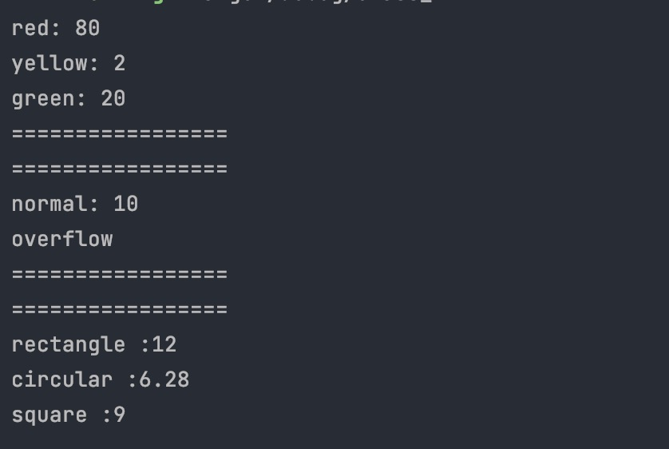

# 第四课作业

## 第一题

traffic.rs
```rust

pub enum TrafficLight{
    Red,
    Yellow,
    Green,
}


pub trait Time{
    fn time(&self) -> u8;
}

impl Time for TrafficLight{
    fn time(&self) -> u8{
        match self {
            TrafficLight::Red => 80,
            TrafficLight::Yellow => 2,
            TrafficLight::Green => 20,
        }
    }
}


```

#### 运行

```rust

    println!("red: {}",TrafficLight::Red.time());
    println!("yellow: {}",TrafficLight::Yellow.time());
    println!("green: {}",TrafficLight::Green.time());

```

## 第二题

math_own.rs 

```rust
pub fn total(param : &[u32] ) -> Option<u32>{
    let mut total_temp  = 0u32;
    for i in param{
        if u32::MAX - i >= total_temp{
            total_temp = total_temp + i;
        }else{
            return None;
        }
    }
    Some(total_temp)
}

```

### 运行


```rust

    if let Some(s) = total(&[1u32,2u32,3u32,4u32]){
        println!("normal: {}",s);
    }
    if total(&[1u32,u32::MAX]).is_none(){
        println!("overflow");
    }


```

## 第三题

area.rs 

```rust

use std::ops::Mul;

pub struct Rect<T, U>
{
    pub width: T,
    pub height: U,
}

impl<T, U> Rect<T, U> {
    pub fn area(&self) -> T
        where T: Mul<Output=T> + Copy,     // Mul的第一个参数，表示让这个类型和自身相乘，Output表示输出值的类型
              U: Into<T> + Copy {
        self.width.mul(self.height.into())
    }
}

```


### 运行


```rust

  let rectangle = Rect{width:3, height:4};
    println!("rectangle :{}", rectangle.area());

    // 圆形 半径 2，π 3.14
    let circular = Rect{width:3.14, height:2};
    println!("circular :{}", circular.area());

    // 正方形 宽3
    let square = Rect{width:3, height:3};
    println!("square :{}", square.area());
```


# 最终运行结果

